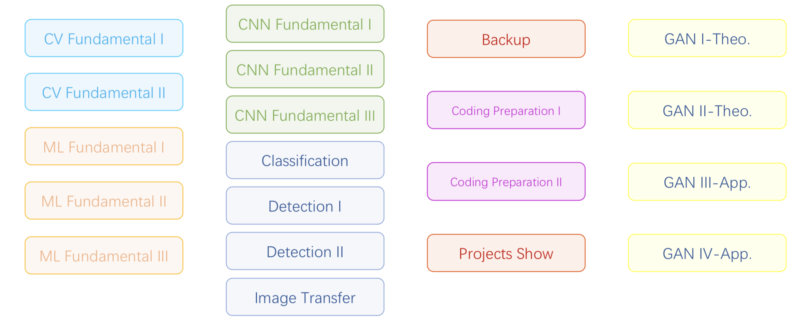

## Note-lecture-1

[TOC]

### Course Introduction

#### Optional Courses:

+ CV in Self-Driving Cars
+ Face Recognition
+ GAN

####  CV Field

| Research          | Applications                       | Engineering            |
| ----------------- | ---------------------------------- | ---------------------- |
| AutoML            | **Image**/Video **Classification** | Modified Models        |
| Acceleration      | **Object Detection**               | **Light Models**       |
| New Applications  | Keypoint Detection                 | Accelerating Algorithm |
| **New Structure** | Recognition                        | Fixed Point            |
| Refinement        | **Segmentation**                   | "Applicationized"      |
| ...               | Voxel                              | Implement Applications |
|                   | Tracking                           | Hardware/Chips         |
|                   | 2D-3D / 3D-2D                      |                        |
|                   | Image Captioning                   |                        |
|                   | **Image Transfer**                 |                        |
|                   | Mixed Inputs                       |                        |
|                   | **GAN**                            |                        |
|                   | Slam                               |                        |
|                   | ...                                | ...                    |

#### Course Schedule

#### Coding Preparation

+ Amount：200 / 300+
+ Criterion：40min, 4/5, medium
+ [Material](./coding-preparation-1.pdf)

#### 3 Projects

+ classical CV（3 weeks）
+ simple CNN（1-2 weeks）— like multi-classification
+ real task（rest time）

#### VPN Reco：PandaPaw

### Image Introduction (Low level image processing)

#### Base Operation I

+ Read in (gray or color) / show out
+ Print out an image
+ Image data type / shape / crop
+ Channels / Spaces
+ Change color (Assignment)
+ Gamma Correction
+ Histogram (💡==adaptive & align== )

#### Base Operation II

+ `Similarity Transform` = `Rotation` + `Translation` + `Scale`

  **Right angle is still right angle**

+ Affine Transform

  **Parallel lines are still parallel lines**

  3 Non-Collinear Point Pairs determines 1 Affine Transform (💡==why==)

+ Perspective Transform

  **Lines are still lines**

  

